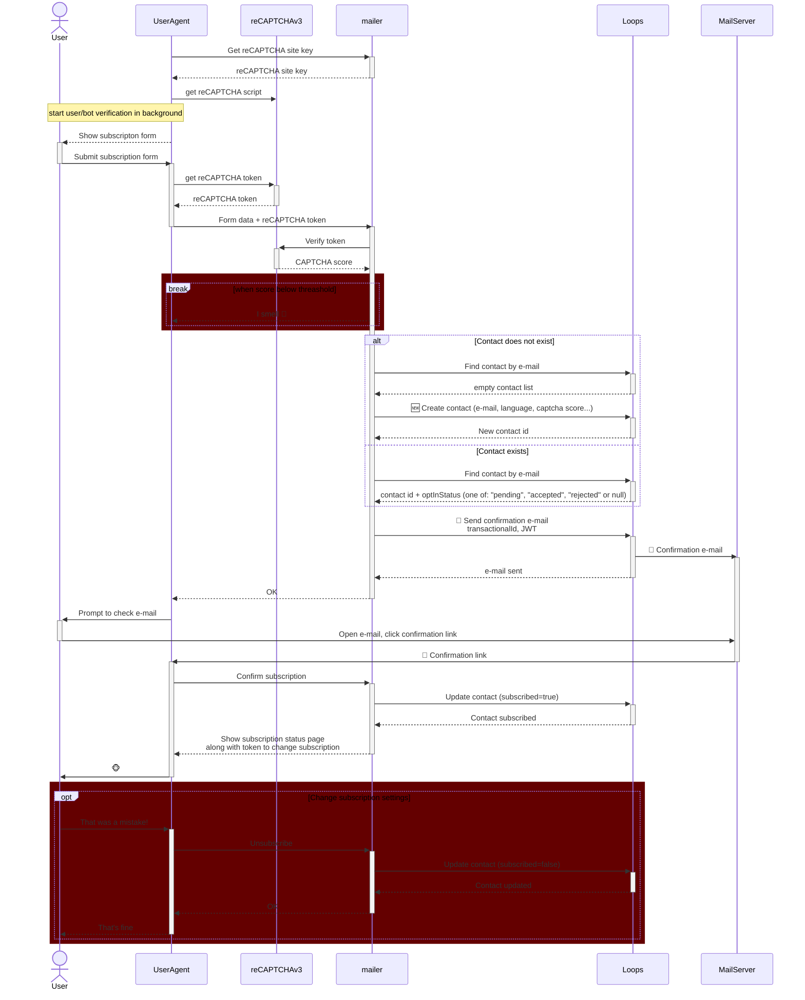

# Mailer

Newsletter subscription management for loops.so

## Features

- ✅ Deployable as netlify functions
- ✅ reCAPTCHA v2/v3 validation
- ✅ Double opt-in mailing
- ✅ CORS enabled
- ✅ Environment variable configuration

## Setup

### 1. Install Dependencies

```bash
npm install
```

### 2. Configure

Set your reCAPTCHA secret key as an environment variable in Netlify:

**Via Netlify Dashboard:**
1. Go to your site's settings (https://app.netlify.com/ » choose project » project configuration)
2. Navigate to "Environment variables"
3. Add variables:
 - `JWT_SECRET` - Secret key for JWT token signing
 - `RECAPTCHA_SITE_KEY` - reCAPTCHA site key (public)
 - `RECAPTCHA_SECRET` - reCAPTCHA secret key
 - `LOOPS_SO_SECRET` - Loops.so API key
 - `CAPTCHA_PROVIDER` - CAPTCHA provider (default: `recaptcha`, options: `recaptcha`, `none`)
 - `CAPTCHA_THRESHOLD` - CAPTCHA score threshold (default: `0.5`)
 - `COMPANY_NAME` - Company name for email templates (optional)
 - `COMPANY_ADDRESS` - Company address for email templates (optional)

**Via Netlify CLI:**
```bash
npx netlify link
npx netlify env:set --context production deploy-preview --secret JWT_SECRET $(dd count=1 ibs=32 if=/dev/random status=none | base64)
npx netlify env:set CAPTCHA_PROVIDER recaptcha
# https://console.cloud.google.com/security/recaptcha/
npx netlify env:set RECAPTCHA_SITE_KEY "your-site-key"
npx netlify env:set --context production deploy-preview --secret RECAPTCHA_SECRET "your-secret-key-here"
# https://app.loops.so/settings?page=api
npx netlify env:set --context production deploy-preview --secret LOOPS_SO_SECRET "your-secret-key-here"
```

**For Local Development:**
Create a `.env` file in the root directory:
```
JWT_SECRET=long-generated-password-for-token-signing

CAPTCHA_PROVIDER=recaptcha|hcaptcha|none
CAPTCHA_THRESHOLD=0.5

# https://console.cloud.google.com/security/recaptcha/
RECAPTCHA_SITE_KEY=public-site-key
RECAPTCHA_SECRET=your-secret-key-here

# https://app.loops.so/settings?page=api
LOOPS_SO_SECRET=your-secret-key-here

# Optional: Company information for email templates
COMPANY_NAME=Your Company Name
COMPANY_ADDRESS=Your Company Address
```

**Via Netlify CLI when .env file is created** 
```bash
npx netlify link
npx netlify env:import .env
npx netlify env:set JWT_SECRET --secret
npx netlify env:set RECAPTCHA_SECRET --secret
npx netlify env:set LOOPS_SO_SECRET --secret
```

### 3. Build

```bash
npm run build
```

### 4. Deploy

```bash
netlify deploy --prod
```

Or use the Netlify CLI to deploy:
```bash
netlify deploy
```

## Local Development

Run the Netlify development server:

```bash
npm run dev
```

Sample subscription form will be available at: `http://localhost:8888/`

## Usage

### Double opt-in on loops
As of right now (December 2025) the built-in loops mechanizm for e-mail confirmation ([Double opt-in](https://loops.so/docs/contacts/double-opt-in))
is only supported when subscribing through forms.  API can read the `optInStatus` but cannot update it.
To circumvent this issue you need to keep the loops double opt-in mechanizm disabled.
Go to [sending options](https://app.loops.so/settings?page=sending) and make sure the `New contacts confirm subscription by email` option is disabled.

Instead the mailer will use it's own mechanizm with custom `xOptInStatus` property.
It will search for transactional e-mail with `{optInUrl}` data variable.
You can translate confirmation email into multiple languages.
Mailer will try to find right translation by email name.


### Including form

TODO: describe including subscription form on site

### Endpoints

#### GET /api/recaptcha

Retrieve reCAPTCHA site key
**Response:**
```json
{
  success: true
  recaptcha_site_key: "reCAPTCHA-site-key-to-load-google-cloud-API"
}
```

#### GET /api/subscribe

Retrieves the list of publicly available mailing lists.

**Response:**
```json
[
  {
    "id": "mailing-list-id",
    "name": "Newsletter",
    "description": "Mailing list description",
    "isPublic": true
  }
]
```

#### POST /api/subscribe

Subscribes an email address to the newsletter with double opt-in.

**Request Body:**
```json
{
  "email": "user@example.com",
  "captcha_token": "reCAPTCHA-response-token-from-client",
  "mailing_lists": ["mailing-list-id-1", "mailing-list-id-2"],
  "language": "en"
}
```

**Request Fields:**
- `email` (required): Email address to subscribe
- `captcha_token` (required): reCAPTCHA v3 response token from client
- `mailing_lists` (optional): Array of mailing list IDs to subscribe to
- `language` (optional): Language code for email templates (e.g., "en", "pl")
- Additional properties: Any other contact properties can be included and will be stored in Loops

**Success Response:**
```json
{
  "success": true,
  "contact": {
    "id": "contact-id",
    "email": "user@example.com",
    "subscribed": true,
    "mailingLists": {},
    "optInStatus": "accepted"
  }
}
```

**Error Response:**
```json
{
  "success": false,
  "error": "Error message description"
}
```

### Error Codes

Common HTTP error responses:
- `400 Bad Request`: Invalid request format or missing required fields
- `405 Method Not Allowed`: HTTP method not supported for the endpoint
- `429 Too Many Requests`: Too many subscription requests from IP address or CAPTCHA validation failed (score below threshold)
- `500 Internal Server Error`: Server configuration or processing error

## Architecture

Principles:

1. It has to prevent bots from subscribing to e-mails: CAPTCHA + confirmation e-mail
2. Should we relax the requirement for e-mail confirmation when CAPTCHA score is high?
3. The agent should be stateless. The user flow should be authorized by time limited [JWT](https://datatracker.ietf.org/doc/html/rfc7519)



### sample JWT

```json
{
  "sub": "subcriber@example.com",
  "iss": "mailer.domain.org",
  "exp": Date.now()/1000 + 600 
}
```

## Project Structure

```
.
├── frontend/                    # Frontend source code
│   └── dist/                    # Publish directory (generated)
├── backend/                     # Serverless backend source code
│── netlify/functions/           # Netlify functions
├── netlify.toml                 # Netlify configuration
├── package.json                 # Dependencies
├── webpack.config.js            # Webpack configuration — used to generate frontend/dist
├── tsconfig.json                # TypeScript configuration (frontend & backend)
└── README.md                    # This file
```
