# Carajillo

Newsletter subscription management for [Loops](https://loops.so/).

## Features

- Double opt-in subscription — a replacement for [Loops built-in](https://loops.so/docs/contacts/double-opt-in)
- Panel for users to manage mailing list subscription
- Localization support
- reCAPTCHA v2/v3 validation
- CORS enabled
- Deployable as netlify functions

## Roadmap

- [ ] [https://www.hcaptcha.com/] support
- [ ] Subscription token rotation/refresh
- [ ] Loops configuration verification

## Setup

### Deploy on Netlify
```
npm install
./scripts/generate-env.bash >.env.production.local
$EDITOR .env.production.local
npx netlify site:create
./scripts/netlify-import-env.bash .env.production.local
```

### Local Development

```bash
npm install
./scripts/generate-env.bash >.env.development.local
ln -s .env.development.local .env
npm run prebuild
npm run dev
```

Sample subscription form will be available at: `http://localhost:8888/`

## Usage

### Double opt-in on loops
As of right now (December 2025), the built-in loops mechanism for e-mail confirmation ([Double opt-in](https://loops.so/docs/contacts/double-opt-in)) is only supported when subscribing through forms.
API can read the `optInStatus` but cannot update it.

Check https://loops.so/docs/api-reference/changelog

Instead, carajillo will use its own mechanism with custom `xOptInStatus` property.
It will search for transactional e-mail with `xOptInUrl` data variable.
You can translate confirmation emails into multiple languages.
Carajillo will try to find the right translation by email name.

Go to https://app.loops.so/transactional and create confirmation e-mails for each language you need supported.
Add a tag with the language code in the email. For example, for English name the email `Double Opt-In #EN`.
Use following data variables:
 - `xOptInUrl` (required) — for button to confirm the subscription,
 - `companyName`
 - `companyAddress`
 - `companyLogo`.

### Including form

```html
<form class="subscribe-form" action="https://carajillo.example.com/api/honeypot">
  <input type="text" name="firstName" placeholder="Name">
  <input type="email" name="email" placeholder="Email" required>
  <input type="hidden" name="mailingLists" value="comma, delimited, mailingListIds">
  <input type="hidden" name="language" value="en">
  <input type="submit" value="Submit">
  <div class="subscribe-status"></div>
  <noscript><p>Enable Javascript in your browser to subscribe.</p></noscript>
</form>
<script src="https://carajillo.example.com/subscribe.js"></script>
```

## Architecture

Principles:

1. It has to prevent bots from subscribing to e-mails: CAPTCHA + confirmation e-mail
2. Should we relax the requirement for e-mail confirmation when CAPTCHA score is high?
3. The agent should be stateless. The user flow should be authorized by time-limited [JWT](https://datatracker.ietf.org/doc/html/rfc7519)

### Use cases


---

```mermaid
---
title: Control panel state diagram 
---
stateDiagram-v2
  classdef stable font-weight: bold
  classdef temporary  font-style:italic
  classdef good fill:#030
  classdef bad fill:#300
  classdef ugly fill:#330
  class Pending, Accepted, Rejected  stable
  class Subscribing, Error temporary
  class Accepted good
  class Error bad
  class Pending, Rejected ugly
  Fetching: Fetching subscription data

  [*] --> Fetching
  Fetching --> Pending: First click
  Pending --> Subscribing: Window visible or button clicked
  Subscribing --> Accepted: 🥳 Confetti
  Fetching --> Accepted: Previously accepted
  Fetching --> Rejected: Previously rejected
  Accepted --> Rejected: Unsubscribe
  Rejected --> Accepted: Resubscribe
  Fetching --> Error: Token expired
  Error --> [*]: Refresh token
```



## Project Structure

```
.
├── package.json                 # Dependencies
├── frontend/                    # Frontend source code
│   ├── locales/                 # Directory with translations (generated)
│   └── dist/                    # Publish directory (generated)
├── backend/                     # Serverless backend source code
├── translation/*.xlf            # Translation files in XLIFF format
├── netlify/functions/           # Netlify functions
├── netlify.toml                 # Netlify configuration
├── webpack.config.js            # Webpack configuration — used to generate frontend/dist
├── tsconfig.json                # TypeScript configuration (frontend & backend)
├── lit-localize.json            # Translation settings
└── README.md                    # This file
```
