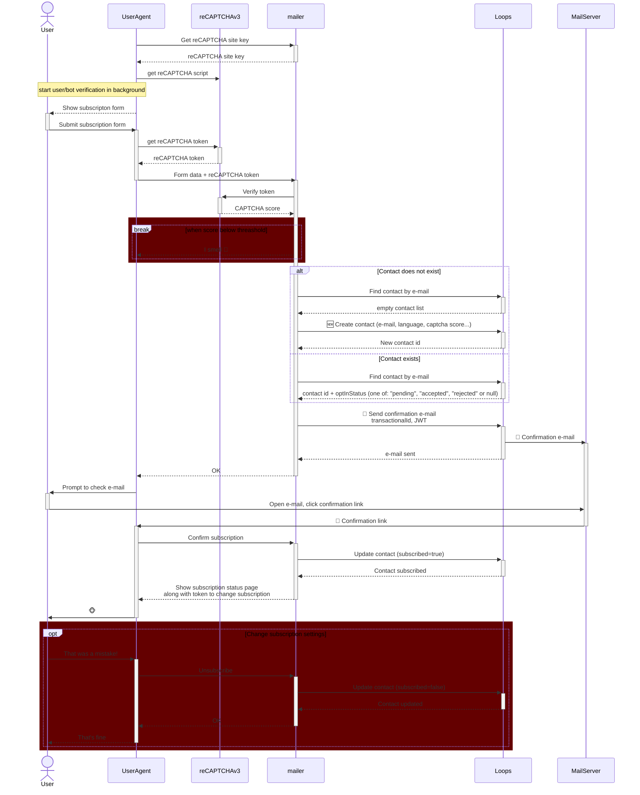

# Mailer

Newsletter subscription management for loops.so

## Features

- ✅ Deployable as netlify functions
- ✅ reCAPTCHA v2/v3 validation
- ✅ Double opt-in mailing
- ✅ CORS enabled
- ✅ Environment variable configuration

## Setup

### 1. Install Dependencies

```bash
npm install
```

### 2. Configure

Set your reCAPTCHA secret key as an environment variable in Netlify:

**Via Netlify Dashboard:**
1. Go to your site's settings
2. Navigate to "Environment variables"
3. Add variables:
 - `JWT_SECRET`
 - `RECAPTCHA_SITE_KEY`
 - `RECAPTCHA_SECRET`
 - `LOOPS_SECRET`

**Via Netlify CLI:**
```bash
npx netlify link
npx netlify env:set --context production deploy-preview --secret JWT_SECRET $(dd count=1 ibs=32 if=/dev/random status=none | base64)
npx netlify env:set CAPTCHA_PROVIDER recaptcha
# https://console.cloud.google.com/security/recaptcha/
npx netlify env:set RECAPTCHA_SITE_KEY "your-site-key"
npx netlify env:set --context production deploy-preview --secret RECAPTCHA_SECRET "your-secret-key-here"
# https://app.loops.so/settings?page=api
npx netlify env:set --context production deploy-preview --secret LOOPS_SECRET "your-secret-key-here"
```

**For Local Development:**
Create a `.env` file in the root directory:
```
JWT_SECRET=long-generated-password-for-token-signing

CAPTCHA_PROVIDER=recaptcha|hcaptcha|none
CAPTCHA_THRESHOLD=0.5

# https://console.cloud.google.com/security/recaptcha/
RECAPTCHA_SITE_KEY=public-site-key
RECAPTCHA_SECRET=your-secret-key-here

# https://app.loops.so/settings?page=api
LOOPS_SECRET=your-secret-key-here
```

**Via Netlify CLI when .env file is created** 
```bash
npx netlify link
npx netlify env:import .env
npx netlify env:set JWT_SECRET --secret
npx netlify env:set RECAPTCHA_SECRET --secret
npx netlify env:set LOOPS_SECRET --secret
```

### 3. Build

```bash
npm run build
```

### 4. Deploy

```bash
netlify deploy --prod
```

Or use the Netlify CLI to deploy:
```bash
netlify deploy
```

## Local Development

Run the Netlify development server:

```bash
npm run dev
```

Sample subscription form will be available at: `http://localhost:8888/`

## Usage

### Endpoint

`POST /.netlify/functions/subscribe`

### Request Body

```json
{
  "token": "reCAPTCHA-response-token-from-client"
}
```

### Success Response

```json
{
  "success": true,
  "message": "reCAPTCHA validation successful",
  "challenge_ts": "2024-01-01T12:00:00Z",
  "hostname": "example.com"
}
```

### Error Response

```json
{
  "success": false,
  "error": "reCAPTCHA validation failed",
  "error-codes": ["invalid-input-response"]
}
```

### Architecture

Principles:

1. It has to prevent bots from subscribing to e-mails: CAPTCHA + confirmation e-mail
2. Should we relax the requirement for e-mail confirmation when CAPTCHA score is high?
3. The agent should be stateless. The user flow should be authorized by time limited [JWT](https://datatracker.ietf.org/doc/html/rfc7519)



### sample JWT

```json
{
  "iss": "newsletter@domain.org",
  "sub": "subcriber@example.com",
  "aud": "mailer.domain.org",
  "exp": Date.now()/1000 + 600 
}
```

## API Reference

### Error Codes

Common reCAPTCHA error codes:
- `missing-input-secret`: The secret parameter is missing
- `invalid-input-secret`: The secret parameter is invalid or malformed
- `missing-input-response`: The response parameter is missing
- `invalid-input-response`: The response parameter is invalid or malformed
- `bad-request`: The request is invalid or malformed
- `timeout-or-duplicate`: The response is no longer valid (either too old or has been used previously)

## Project Structure

```
.
├── backend/                     # Serverless backend source code
├── frontend/                    # Publish directory
│── netlify/functions/           # Compiled functions (generated)
├── netlify.toml                 # Netlify configuration
├── package.json                 # Dependencies
├── tsconfig.json                # TypeScript configuration
└── README.md                    # This file
```
