# Mailer

Newsletter subscription management for loops.so

## Features

- ✅ Deployable as netlify functions
- ✅ reCAPTCHA v2/v3 validation
- ✅ Double opt-in mailing
- ✅ CORS enabled
- ✅ Environment variable configuration

## Setup

### 1. Install Dependencies

```bash
npm install
npx netlify site:create
```

### 2. Configure

Set your reCAPTCHA secret key as an environment variable in Netlify:

**Via Netlify Dashboard:**
1. Go to your site's settings (https://app.netlify.com/ » choose project » project configuration)
2. Navigate to "Environment variables"
3. Add variables:
 - `COMPANY_NAME` - Company name for email templates (optional)
 - `COMPANY_ADDRESS` - Company address for email templates (optional)
 - `COMPANY_LOGO` - URL of company logo image (optional)
 - `CORS_ORIGIN` - Domains where submission forms may be created (default: all submissions are accepted)
 - `JWT_SECRET` - Secret key for JWT token signing
 - `JWT_EXPIRATION` - How long token in e-mail confirmation link is valid (default: 1 year)
 - `LOOPS_SO_SECRET` - Loops.so API key
 - `CAPTCHA_PROVIDER` - CAPTCHA provider (default: `recaptcha`, options: `recaptcha`, `none`)
 - `CAPTCHA_THRESHOLD` - CAPTCHA score threshold (default: `0.5`)
 - `RECAPTCHA_SITE_KEY` - reCAPTCHA site key (public)
 - `RECAPTCHA_SECRET` - reCAPTCHA secret key

**For Local Development:**
Create a `.env` file(s) in the root directory:
```bash
./scripts/generate-env.bash >.env.development.local
./scripts/generate-env.bash >.env.production.local
```

**Via Netlify CLI when .env file is created** 
```bash
./script/netlify-import-env.bash .env.production.local
```

### 3. Build

```bash
npm run build
```

### 4. Deploy

```bash
netlify deploy --prod
```

## Local Development

Run the Netlify development server:

```bash
npm run dev
```

Sample subscription form will be available at: `http://localhost:8888/`

## Usage

### Double opt-in on loops
As of right now (December 2025), the built-in loops mechanism for e-mail confirmation ([Double opt-in](https://loops.so/docs/contacts/double-opt-in))
is only supported when subscribing through forms.  API can read the `optInStatus` but cannot update it.
To circumvent this issue you need to keep the loops double opt-in mechanism disabled.
Go to [sending options](https://app.loops.so/settings?page=sending) and make sure the `New contacts confirm subscription by email` option is disabled.

Check https://loops.so/docs/api-reference/changelog

Instead the mailer will use its own mechanism with custom `xOptInStatus` property.
It will search for transactional e-mail with `xOptInUrl` data variable.
You can translate confirmation email into multiple languages.
Mailer will try to find right translation by email name.

### Including form

```html
<form class="subscription-form" action="https://mailer.example.com/api/honeypot">
  <input type="text" name="firstName" placeholder="Name">
  <input type="email" name="email" placeholder="Email" required>
  <input type="hidden" name="language" value="en">
  <input type="submit" value="Submit">
  <div class="subscribe-status"></div>
</form>
<script src="https://mailer.example.com/subscribe.js"></script>
```

### Endpoints

#### GET /api/captcha

Retrieve CAPTCHA configuration including site key.

**Response:**
```json
{
  "success": true,
  "provider": "recaptcha",
  "site_key": "reCAPTCHA-site-key-to-load-google-cloud-API"
}
```

#### GET /api/lists

Retrieves the list of publicly available mailing lists.

**Response:**
```json
[
  {
    "id": "mailing-list-id",
    "name": "Newsletter",
    "description": "Mailing list description",
    "isPublic": true
  }
]
```

#### GET /api/subscription

Retrieves the subscription status for the authenticated user. Requires JWT token in `Authorization: Bearer <token>` header.

**Response:**
```json
{
  "success": true,
  "email": "user@example.com",
  "subscribed": true,
  "mailingLists": [
    {
      "id": "mailing-list-id",
      "name": "Newsletter",
      "description": "Mailing list description",
      "subscribed": true
    }
  ]
}
```

#### POST /api/subscription

Subscribes an email address to the newsletter with double opt-in. Sends a confirmation email to the user.

**Request Body:**
```json
{
  "email": "user@example.com",
  "captcha_token": "reCAPTCHA-response-token-from-client",
  "mailing_lists": ["mailing-list-id-1", "mailing-list-id-2"],
  "language": "en"
}
```

**Request Fields:**
- `email` (required): Email address to subscribe
- `captcha_token` (required): reCAPTCHA v3 response token from client
- `mailing_lists` (optional): Array of mailing list IDs to subscribe to
- `language` (optional): Language code for email templates (e.g., "en", "pl")
- Additional properties: Any other contact properties can be included and will be stored in Loops

**Success Response:**
```json
{
  "success": true,
  "email": "user@example.com",
}
```

**Error Response:**
```json
{
  "success": false,
  "error": "Error message description"
}
```

#### PUT /api/subscription

Updates subscription status for the authenticated user. Requires JWT token in `Authorization: Bearer <token>` header.

**Request Body:**
```json
{
  "email": "user@example.com",
  "subscribe": true,
  "mailingLists": {
    "mailing-list-id-1": true,
    "mailing-list-id-2": false
  }
}
```

**Request Fields:**
- `email` (required): Email address (must match JWT token subject)
- `subscribe` (required): Boolean to subscribe (true) or unsubscribe (false)
- `mailingLists` (required): Object mapping mailing list IDs to subscription status

**Success Response:**
```json
{
  "success": true,
  "email": "user@example.com",
  "subscribed": true
}
```

### Error Codes

Common HTTP error responses:
- `400 Bad Request`: Invalid request format or missing required fields
- `405 Method Not Allowed`: HTTP method not supported for the endpoint
- `429 Too Many Requests`: Too many subscription requests from IP address or CAPTCHA validation failed (score below threshold)
- `500 Internal Server Error`: Server configuration or processing error

## Architecture

Principles:

1. It has to prevent bots from subscribing to e-mails: CAPTCHA + confirmation e-mail
2. Should we relax the requirement for e-mail confirmation when CAPTCHA score is high?
3. The agent should be stateless. The user flow should be authorized by time limited [JWT](https://datatracker.ietf.org/doc/html/rfc7519)

### Use cases

```mermaid
---
title: Subscription sequence diagram 
---
sequenceDiagram
  actor User
  participant UserAgent
  participant reCAPTCHAv3
  participant mailer
  participant Loops
  participant MailServer

  UserAgent ->>+ mailer: Get reCAPTCHA site key
  mailer -->>- UserAgent: reCAPTCHA site key
  UserAgent ->> reCAPTCHAv3: get reCAPTCHA script
  note over User,UserAgent: start user/bot verification in background

  UserAgent -->>+ User: Show subscription form

  User ->>- UserAgent: Submit subscription form
  activate UserAgent
  UserAgent ->>+ reCAPTCHAv3: get reCAPTCHA token
  reCAPTCHAv3 -->>- UserAgent: reCAPTCHA token
  UserAgent ->> mailer: Form data + reCAPTCHA token + initial mailing list set
  deactivate UserAgent

    activate mailer
    mailer ->>+ reCAPTCHAv3: Verify token
    reCAPTCHAv3 -->>- mailer: CAPTCHA score
    rect rgb(100, 0, 0)
      break when score below threshold
        mailer -->> UserAgent: I smell 🤖
      end
    end

    alt Contact does not exist
      mailer ->>+ Loops: Find contact by e-mail
      Loops -->>- mailer: empty contact list
      mailer ->>+ Loops: 🆕 Create contact (e-mail, language, captcha score...)
      Loops -->>- mailer: New contact id
    else Contact exists
      mailer ->>+ Loops: Find contact by e-mail
      Loops -->>- mailer: contact id + optInStatus (one of: "pending", "accepted", "rejected" or null)
    end
    mailer ->>+ Loops: 📨 Send confirmation e-mail<br/>transactionalId, JWT
    Loops ->> MailServer: 📨 Confirmation e-mail
    activate MailServer
    Loops -->>- mailer: e-mail sent

  mailer -->> UserAgent: OK
  deactivate mailer
  UserAgent ->>+ User: Prompt to check e-mail

  User ->>- MailServer: Open e-mail, click confirmation link
  MailServer ->> UserAgent: 🔗 Confirmation link
  deactivate MailServer
  activate UserAgent
  UserAgent ->>+ mailer: Confirm subscription
    mailer ->>+ Loops: Update contact (subscribed=true)
    Loops -->>- mailer: Contact subscribed
  mailer -->>- UserAgent: Show subscription status page<br/>along with token to change subscription
  UserAgent ->> User: 🐵
  deactivate UserAgent

  rect rgb(100, 0, 0)
    opt Change subscription settings
      User ->>+ UserAgent: That was a mistake!
      UserAgent ->>+ mailer: Unsubscribe
      mailer ->>+ Loops: Update contact (subscribed=false)
      Loops -->>- mailer: Contact updated
      mailer -->>- UserAgent: OK
      UserAgent -->>- User: That's fine
    end
  end
```




## Project Structure

```
.
├── package.json                 # Dependencies
├── frontend/                    # Frontend source code
│   ├── locales/                 # Directory with translations
│   │   └── xliff/*.xlf          # Translation files in XLIFF format
│   └── dist/                    # Publish directory (generated)
├── backend/                     # Serverless backend source code
│── netlify/functions/           # Netlify functions
├── netlify.toml                 # Netlify configuration
├── webpack.config.js            # Webpack configuration — used to generate frontend/dist
├── tsconfig.json                # TypeScript configuration (frontend & backend)
├── lit-localize.json            # Translation settings
└── README.md                    # This file
```
